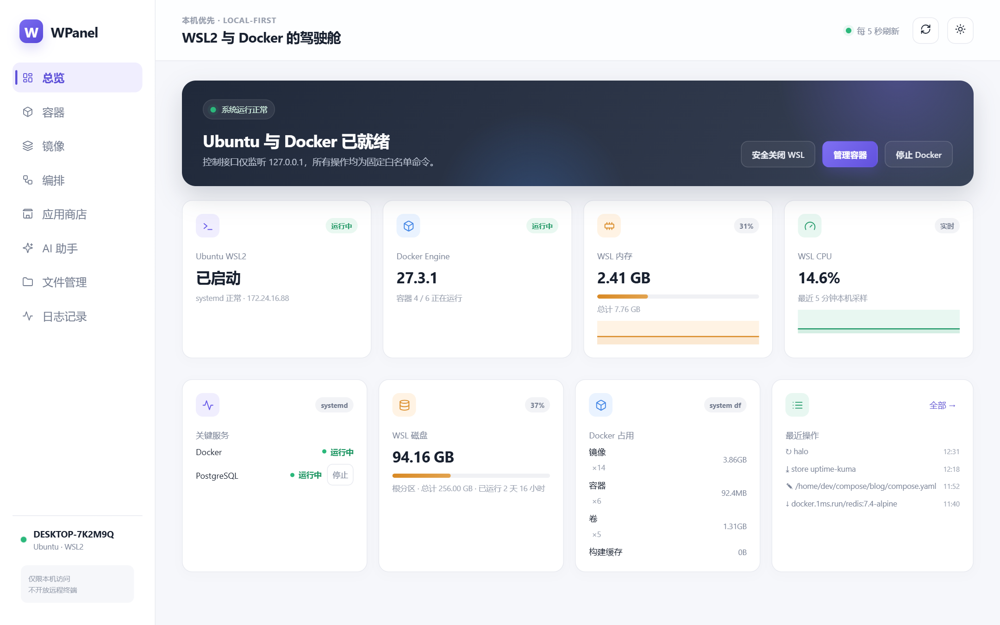

# WPanel

**English** | WPanel 是面向 Windows 本机的 WSL2 与 Docker 可视化管理面板。它运行在 Windows 侧，通过 `wsl.exe` 与 `\\wsl.localhost` 直接管理 WSL2 发行版、原生 Docker 服务与文件系统，无需在 Linux 内安装任何组件。

> For: Windows 11 + WSL2 + native dockerd (systemd) + Node.js 22+
> Not for: Docker Desktop users / multi-host management



## 定位

| | 说明 |
|---|---|
| **比 DPanel 多** | WSL2 生命周期管理（启动/安全关闭）、主机（WSL）文件管理、systemd 服务控制、文件直读零 agent |
| **对齐 DPanel** | 容器生命周期、实时日志、镜像/卷管理、Compose 编排、应用商店 |
| **明确不做** | 域名转发、多机管理、容器内文件管理（DPanel 已做得很好）、远程访问 |
| **不适用** | Docker Desktop 用户（WPanel 需要 WSL 内原生 dockerd + systemd） |

## 功能

- **总览**：Ubuntu/Docker 状态、内存与 CPU（5 分钟趋势）、WSL 磁盘用量、运行时长、systemd 关键服务（可配置、可启停）、Docker 磁盘占用、最近操作
- **容器**：卡片/列表双视图、启动/停止/重启、实时日志（SSE 跟随、行数切换、复制）、端口徽章直达 localhost、compose 项目分组
- **镜像 / 卷**：列表、删除、清理悬空镜像与未使用卷
- **Compose 编排**：自动发现扫描目录下的 compose 项目，up/down/日志，在线编辑 compose 文件
- **应用商店**：默认内置 1Panel 官方商店源（兼容其模板格式，自动忽略模板中的脚本类字段），支持自定义模板源；选应用 → 填参数 → 预览 → 一键部署
- **文件管理**：通过 `\\wsl.localhost` 直接浏览 WSL 文件系统（默认仅 `/home`），在线编辑（≤1MB 文本）、上传下载、重命名、删除、图片预览
- **日志记录**：全部操作审计，分页浏览（每页 30 条）+ 关键字搜索
- **AI 助手**（需自行配置 OpenAI 兼容接口）：容器日志诊断、Compose 生成、运维操作提议——**AI 只有建议权，没有执行权**，所有动作需逐条确认后才走白名单接口执行
- **容器命令盒**（实验性）：在指定容器内执行单条命令并查看输出
- 深色 / 浅色 / 跟随系统三主题

## 安全模型

- 控制服务仅监听 `127.0.0.1`，前端来源白名单校验
- 所有变更操作需要会话令牌（每次启动随机生成）
- 后端只有**固定白名单命令**，没有任意命令执行接口
- 文件接口有根目录白名单（`WPANEL_ROOTS`）、路径标准化与符号链接逃逸校验
- 危险操作（删除镜像/卷、关闭 WSL、卸载应用）需前端确认，全部操作写入审计日志
- 文件共享以 WSL 默认用户身份访问，root 属地（`/root`、`/etc` 等）天然不可操作

## 快速开始

```powershell
git clone https://github.com/<you>/wpanel.git
cd wpanel
npm install
npm run build
.\启动WPanel.bat        # 启动并打开 http://localhost:8765
.\安装开机自启.bat      # 可选：登录 Windows 后台静默自启
```

前提：Windows 11、WSL2 发行版已启用 systemd（`/etc/wsl.conf` 中 `[boot] systemd=true`）、发行版内安装了原生 Docker Engine、Node.js ≥ 22.13。

## 配置

| 环境变量 | 默认 | 说明 |
|---|---|---|
| `WPANEL_PORT` | `8766` | 控制服务端口 |
| `WPANEL_DISTRO` | `Ubuntu` | 目标 WSL 发行版名 |
| `WPANEL_ROOTS` | `/home` | 文件管理允许的根目录（逗号分隔） |
| `WPANEL_COMPOSE_DIR` | 第一个允许根目录下的 `compose` | Compose 项目扫描目录 |
| `NEXT_PUBLIC_WPANEL_API` | `http://127.0.0.1:8766` | 前端控制服务地址（构建时注入） |

`data/wpanel.local.json`（不进 git）可扩展总览页监控的 systemd 服务：

```json
{ "services": [ { "key": "postgresql", "name": "PostgreSQL", "unit": "postgresql.service" } ] }
```

## Roadmap

- [x] v0.1：容器/镜像/卷/Compose/应用商店/文件管理/服务控制/AI 助手/容器命令盒
- [ ] 容器交互式终端（PTY，当前命令盒为单命令执行）
- [ ] 应用商店支持本地自定义模板包
- [ ] 界面多语言

## 开发

```bash
npm run dev         # 前端开发模式
npm run controller  # 单独启动控制服务（WPANEL_PORT 可覆盖端口）
npm run build       # 生产构建
npm run lint        # ESLint
```

## 致谢

设计参考了 [DPanel](https://github.com/donknap/dpanel) 与 [Dockge](https://github.com/louislam/dockge) 的交互思路；应用商店模板格式兼容 [1Panel AppStore](https://github.com/1Panel-dev/appstore)。

## License

[MIT](LICENSE)
